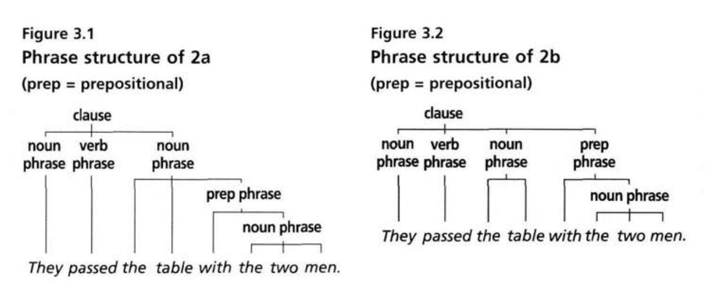
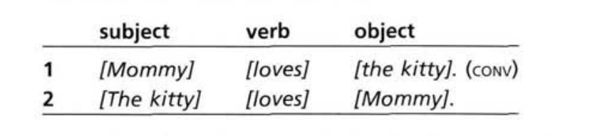

# 英语语言学习丨短语专题1：短语的特点

## 专题概述

本专题总结自《朗文学生语法：英语口语与书面语（*Longman Student Grammar of Spoken and Written English*）》（以下简称《朗文学生语法》）第三章"短语与从句导论（Chapter 3: Introduction to Phrases and Clauses）"。本专题是对其中第一部分"语法要点A"的总结与扩展，主要探讨**单词（Words）与短语（Phrases）之间的构成关系**。本专题将延续《朗文学生语法》所坚持的描述性视角，即重视从语言的实际使用而非书本规范出发来分析语言特点。关于"描述性"的说明，可参见此前的语言学概述部分。本文将对大量实际语料进行分析，较少给出绝对化定义，也不会对传统语法规则作长篇阐述。读者可结合采用规范性视角的语法书，即传统语法书，进行补充学习。

---

## 短语及其特征

在之前的形态学简介中，我们定义了单词的含义："单词是承载了客观或实际意义的语言的基本元素。它可以被单独使用，且具有不可被分割的特点。"

单词可以被组织成更高层次的单位，即短语。我们可以先从下文的例句1来认识短语：在例句1中，被方括号标注出的单位即为短语。该句共有3个短语。

> **例句 1**
> [The opposition] [demands] [a more representative government].

短语本身可以由一个单词或一组单词构成。我们可以用**替换（substitution）**的方式来检验某个单位是否为短语：如果一组单词可以被一个单词或代词替换，并且替换后句子的基本语法结构仍然成立，那么这组单词通常可以被认为是一个短语。如上文的例句1可以进行如下替换：*The opposition* 可被 *It* 替换，*a more representative government* 可被 *something* 替换。替换后，该句的含义可保持不变。

> [It] [demands] [something].

我们也可以通过**移位测试（movement tests）**来识别短语：如果一组词可以作为整体参与句法位置的变化，那么它通常具有短语单位的性质。可见下文的例句1a：在位移后，句子含义可保持不变。

> **例句 1a**
> [A more representative government] [is demanded] [by [the opposition]].

此外，短语内部还可以出现**嵌入现象（embedding）**，即一个短语内部再"套进去"另一个短语。上文的例句1a就是如此：*is demanded by the opposition* 整体构成一个短语，同时其内部也包含 *by the opposition* 这个介词短语。嵌入现象使短语呈现出层级结构；在某些情况下，不同的嵌入位置或结构划分会使同一个词串产生两种或两种以上的理解方式，即结构歧义。关于这一点，可见例句 2。

> **例句 2**
> They passed the table with the two men.

这个例句有两种可能的含义，而每种含义都取决于我们划分短语结构的方式：

> **例句 2a**
> [They] [passed] [the table [with [the two men]]].
>
> **例句 2b**
> [They] [passed] [the table] [with [the two men]]

我们可以用括号标注或树形图来表示短语结构。图 3.1 和图 3.2 分别对应 2a 和 2b 中的两种括号划分方式。在 2a 中，从最外层结构看，我们可以划分出三个主要短语：*They*、*passed* 和 *the table with the two men*。其中，*with the two men* 嵌入在名词短语 *the table with the two men* 内部。因此，2a 的含义大致是："他们经过了那张有两个人坐着的桌子。"

而在 2b 中，从最外层结构看，我们可以划分出四个主要短语：*They*、*passed*、*the table* 和 *with the two men*。这里的 *with the two men* 不再修饰 *the table*，而是和动词 *passed* 联系更紧密，用来说明"他们"和谁一起经过。因此，2b 的含义大致是："他们和那两个人一起经过了那张桌子。"

由此，我们得出了短语的如下特点：

- 短语由单词构成，并在句子中作为一个整体单位（unit）发挥作用。
- 短语可以由一个单词构成，也可以由多个单词构成。
- 短语可通过替换和移位测试来识别。
- 短语结构的差异体现为意义的差异。
- 短语可以出现嵌套现象，即一个短语可以成为另一个短语结构的组成部分。

---

## 短语的句法功能

不同类型的短语不仅在内部结构上有所不同，也在句法功能上有所不同。这里所说的句法功能，指的是短语与更大的结构之间的关系。换言之，我们不仅要看一个短语内部由哪些成分构成，也要看它在句子或更大的短语结构中承担什么作用。如下图所示，当 *Mommy* 和 *the kitty* 这两个名词短语互换位置后，它们的句法功能也发生变化：原来的主语变为宾语，原来的宾语变为主语，而句子的含义也随之改变。

---

## 短语的实际应用

在实际使用中，短语的形式和复杂程度会随着语境、语域和主题的不同而发生变化。日常对话通常倾向于使用较为简短的短语，即由较少单词构成的短语；而在新闻、学术写作等较为正式的语域中，短语往往更加复杂，包含更多修饰成分，也更容易出现多层嵌套结构。

在下面两个语篇中，我们可以看到这一特点（这里的"语篇"指在真实交际中由多个句子或话轮组成、围绕一定主题展开，并具有整体意义和交际功能的语言单位）。需要说明的是，下文并未完整引入原书中的全部语篇示例：

### 语篇 A：日常对话

> A: Is that [the time]?（已经这么晚了吗？）
>
> B: Yeah, it's [twenty minutes to four].（嗯，三点四十了。）
>
> A: Oh [my clock] is slow, yeah.（哦，我的表慢了。）

### 语篇 B：新闻报道

> **[Radioactive leak] confirmed [at Sellafield]**
>
> [Work on the dismantling of a nuclear reprocessing plant at Sellafield] caused [a leak of radioactivity] yesterday. [British Nuclear Fuels Ltd] said [the radioactivity] reached [the air] [through a chimney stack which was still in use]. But [spokesman Bob Phillips] said it was not [an incident which required reporting to the Government]. He dismissed [protests from Friends of the Earth] as "scaremongering". However, [Dr Patrick Green, Friends of the Earth radiation campaigner], said: "BNF has [a scandalous track record of playing down incidents at first, and only admitting their seriousness later]." [Three months ago] BNF confirmed that [a leak of radioactive plutonium solution] [had been reclassified] [as "a serious incident"].
>
> **塞拉菲尔德核泄漏得到证实**
>
> 昨日，塞拉菲尔德一座核燃料后处理厂的拆除工程导致放射性物质泄漏。英国核燃料有限公司表示，放射性物质通过一根仍在使用的烟囱进入空气。但发言人鲍勃·菲利普斯表示，该事件无需向政府报告。他驳斥了来自"地球之友"的抗议，称其为"散布恐慌"。然而，"地球之友"辐射问题活动家帕特里克·格林博士表示："英国核燃料公司有着起初淡化事故、事后才承认问题严重性的劣迹。"三个月前，英国核燃料公司曾证实，一起放射性钚溶液泄漏事故已被重新定级为"严重事故"。

我们可以看到，名词短语和介词短语在书面语中可以相当复杂，有时会呈现出多层嵌套结构。短语的复杂程度通常可以作为衡量不同语域中英语句法复杂性的、重要指标（这里的“语域”是指语言在不同使用场合、交际目的和交际对象下形成的不同风格或变体）。一般而言，日常对话中的短语结构相对简单，小说和新闻写作中的短语结构较为复杂，而学术写作中的短语结构通常最为复杂。
